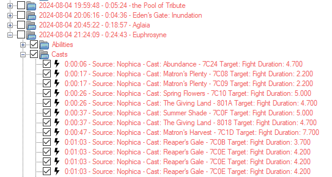

# log-2-triggers

Python script that can be used to convert a log file into list of pulls with associated triggers 

**TODO/Limitations**
- Currently only covers 8-man and 24-man alliance duties
- There is some strange behaviour in alliance raid where you could see player casts in the count but I do filter them out before making triggers
- To add input/output file/folder arguments
- To add support for 4-man duties like criterion
- To add X/Y/Z and X-Heading/Y-Heading/Z-Heading to help identify abilities that are aimed at specific positions

**Usage**
1. Add *.log files into the input folder that you want to be parsed
2. Run the script with the terminal inside the folder log2triggers (or else it won't find the input files)

The result will be output into the "output" folder as an xml file with the same name which can then be imported

